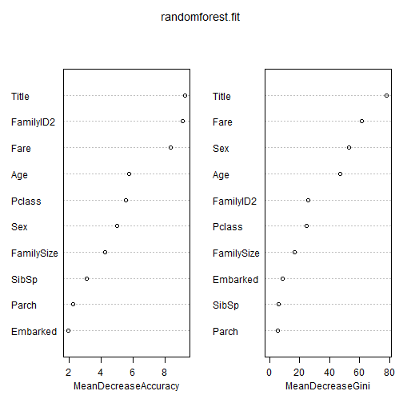

## Introduction
There given two datasets:

- training set
complete with the outcome (or target variable) for a group of passengers as well as a collection of other parameters such as their age, gender, etc. This is the dataset on which you must train your predictive model.
- test set
for which you must predict the now unknown target variable based on the other passenger attributes that are provided for both datasets.


```r
library(rpart) ## descision tree
library(e1071) ## naiveBayes
library(randomForest) ## random forest
library(party) ## ci forest?
```


```r
# getwd()
# setwd("./GitHub/Kaggle/Titanic")
```


## Load train and test datasets

```r
train <- read.csv("~/GitHub/Kaggle/Titanic/train.csv", stringsAsFactors=FALSE)
test <- read.csv("~/GitHub/Kaggle/Titanic/test.csv", stringsAsFactors=FALSE)

str(train)
```

```
## 'data.frame':	891 obs. of  12 variables:
##  $ PassengerId: int  1 2 3 4 5 6 7 8 9 10 ...
##  $ Survived   : int  0 1 1 1 0 0 0 0 1 1 ...
##  $ Pclass     : int  3 1 3 1 3 3 1 3 3 2 ...
##  $ Name       : chr  "Braund, Mr. Owen Harris" "Cumings, Mrs. John Bradley (Florence Briggs Thayer)" "Heikkinen, Miss. Laina" "Futrelle, Mrs. Jacques Heath (Lily May Peel)" ...
##  $ Sex        : chr  "male" "female" "female" "female" ...
##  $ Age        : num  22 38 26 35 35 NA 54 2 27 14 ...
##  $ SibSp      : int  1 1 0 1 0 0 0 3 0 1 ...
##  $ Parch      : int  0 0 0 0 0 0 0 1 2 0 ...
##  $ Ticket     : chr  "A/5 21171" "PC 17599" "STON/O2. 3101282" "113803" ...
##  $ Fare       : num  7.25 71.28 7.92 53.1 8.05 ...
##  $ Cabin      : chr  "" "C85" "" "C123" ...
##  $ Embarked   : chr  "S" "C" "S" "S" ...
```

```r
summary(test)
```

```
##   PassengerId       Pclass         Name               Sex           
##  Min.   : 892   Min.   :1.00   Length:418         Length:418        
##  1st Qu.: 996   1st Qu.:1.00   Class :character   Class :character  
##  Median :1100   Median :3.00   Mode  :character   Mode  :character  
##  Mean   :1100   Mean   :2.27                                        
##  3rd Qu.:1205   3rd Qu.:3.00                                        
##  Max.   :1309   Max.   :3.00                                        
##                                                                     
##       Age            SibSp           Parch          Ticket         
##  Min.   : 0.17   Min.   :0.000   Min.   :0.000   Length:418        
##  1st Qu.:21.00   1st Qu.:0.000   1st Qu.:0.000   Class :character  
##  Median :27.00   Median :0.000   Median :0.000   Mode  :character  
##  Mean   :30.27   Mean   :0.447   Mean   :0.392                     
##  3rd Qu.:39.00   3rd Qu.:1.000   3rd Qu.:0.000                     
##  Max.   :76.00   Max.   :8.000   Max.   :9.000                     
##  NA's   :86                                                        
##       Fare          Cabin             Embarked        
##  Min.   :  0.0   Length:418         Length:418        
##  1st Qu.:  7.9   Class :character   Class :character  
##  Median : 14.5   Mode  :character   Mode  :character  
##  Mean   : 35.6                                        
##  3rd Qu.: 31.5                                        
##  Max.   :512.3                                        
##  NA's   :1
```

## Data Exploration
The disaster was famous for saving "women and children first", so let's take a look at the Sex and Age variables to see if any patterns are evident.

```r
table(train$Survived)
```

```
## 
##   0   1 
## 549 342
```

```r
prop.table(table(train$Sex, train$Survived),1) ## 1 stands for the rows
```

```
##         
##               0      1
##   female 0.2580 0.7420
##   male   0.8111 0.1889
```
We now can see that the majority of females aboard survived, and a very low percentage of males did


```r
## create a new variable Child
train$Child <- 0
train$Child[train$Age < 18] <- 1

## Aggregate Data
aggregate(Survived ~ Child + Sex, data=train, FUN=length)
```

```
##   Child    Sex Survived
## 1     0 female      259
## 2     1 female       55
## 3     0   male      519
## 4     1   male       58
```

```r
## Fare variable
train$Fare2 <- '30+'
train$Fare2[train$Fare < 30 & train$Fare >= 20] <- '20-30'
train$Fare2[train$Fare < 20 & train$Fare >= 10] <- '10-20'
train$Fare2[train$Fare < 10] <- '<10'
aggregate(Survived ~ Fare2 + Pclass + Sex, data=train,
          FUN=function(x) {sum(x)/length(x)})
```

```
##    Fare2 Pclass    Sex Survived
## 1  20-30      1 female   0.8333
## 2    30+      1 female   0.9773
## 3  10-20      2 female   0.9143
## 4  20-30      2 female   0.9000
## 5    30+      2 female   1.0000
## 6    <10      3 female   0.5938
## 7  10-20      3 female   0.5814
## 8  20-30      3 female   0.3333
## 9    30+      3 female   0.1250
## 10   <10      1   male   0.0000
## 11 20-30      1   male   0.4000
## 12   30+      1   male   0.3837
## 13   <10      2   male   0.0000
## 14 10-20      2   male   0.1587
## 15 20-30      2   male   0.1600
## 16   30+      2   male   0.2143
## 17   <10      3   male   0.1115
## 18 10-20      3   male   0.2368
## 19 20-30      3   male   0.1250
## 20   30+      3   male   0.2400
```

### Treat missing values

```r
train <- read.csv("~/GitHub/Kaggle/Titanic/train.csv", stringsAsFactors=FALSE)
test <- read.csv("~/GitHub/Kaggle/Titanic/test.csv", stringsAsFactors=FALSE)
```


### Age Variable
- Method 1: Use the average age value to fill in the missing value

```r
# mean.train.age <- mean(train$Age, na.rm=TRUE)
# train$Age[is.na(train$Age)] <- mean.train.age
# 
# mean.test.age <- mean(test$Age, na.rm=TRUE)
# test$Age[is.na(test$Age)] <- mean.test.age
```

- Method 2: Grow a tree on the subset of the data with the age values available

```r
# ## use decsion tree to predict missing age
# Agefit <- rpart(Age ~ Pclass + Sex + SibSp + Parch + Fare +
#                     Embarked + Title + FamilySize,
#                 data=combi[!is.na(combi$Age),], method='anova')
# combi$Age[is.na(combi$Age)] <- predict(Agefit, combi[is.na(combi$Age),])
```


### Feature Engineering
Feature engineering is so important to how your model performs, that even a simple model with great features can outperform a complicated algorithm with poor ones.

```r
############################ Title ###############################
train$Name[1]
```

```
## [1] "Braund, Mr. Owen Harris"
```

```r
## extract titles from name
test$Survived <- NA
combi <- rbind(train,test)

class(combi$Name)
```

```
## [1] "character"
```

```r
strsplit(combi$Name[1], split='[,.]')
```

```
## [[1]]
## [1] "Braund"       " Mr"          " Owen Harris"
```

```r
strsplit(combi$Name[1], split='[,.]')[[1]][2]
```

```
## [1] " Mr"
```

```r
## Get the title
combi$Title <- sapply(combi$Name, 
                      FUN= function(x) {strsplit(x, split='[,.]')[[1]][2]})
## trim the space
combi$Title <- sub(' ','',combi$Title)

table(combi$Title)
```

```
## 
##         Capt          Col          Don         Dona           Dr 
##            1            4            1            1            8 
##     Jonkheer         Lady        Major       Master         Miss 
##            1            1            2           61          260 
##         Mlle          Mme           Mr          Mrs           Ms 
##            2            1          757          197            2 
##          Rev          Sir the Countess 
##            8            1            1
```

```r
combi$Title[combi$Title %in% c('Mme', 'Mlle')] <- 'Mlle'
combi$Title[combi$Title %in% c('Capt', 'Don', 'Major', 'Sir')] <- 'Sir'
combi$Title[combi$Title %in% c('Dona', 'Lady', 'the Countess', 'Jonkheer')] <- 'Lady'

table(combi$Title)
```

```
## 
##    Col     Dr   Lady Master   Miss   Mlle     Mr    Mrs     Ms    Rev 
##      4      8      4     61    260      3    757    197      2      8 
##    Sir 
##      5
```

```r
################################ Family Size ###########################
## add the number of siblings, spouses, parents and children the passenger 
combi$FamilySize <- combi$SibSp + combi$Parch + 1
## Surname
# strsplit(combi$Name[1],split='[,.]')[[1]][1]
combi$Surname <- sapply(combi$Name, FUN=function(x) {strsplit(x, split='[,.]')[[1]][1]})

combi$FamilyID <- paste(as.character(combi$FamilySize), combi$Surname, sep="")
combi$FamilyID[combi$FamilySize <= 2] <- 'Small'

famIDs <- data.frame(table(combi$FamilyID))
famIDs <- famIDs[famIDs$Freq <= 2,]

combi$FamilyID[combi$FamilyID %in% famIDs$Var1] <- 'Small'

table(combi$FamilyID)
```

```
## 
##        11Sage       3Abbott       3Boulos       3Bourke        3Brown 
##            11             3             3             3             4 
##     3Caldwell      3Collyer      3Compton       3Coutts       3Crosby 
##             3             3             3             3             3 
##       3Danbom       3Davies        3Dodge         3Drew        3Elias 
##             3             5             3             3             3 
##    3Goldsmith         3Hart      3Hickman      3Johnson       3Klasen 
##             3             3             3             3             3 
##       3Mallet        3McCoy     3Moubarek        3Nakid     3Navratil 
##             3             3             3             3             3 
##      3Peacock        3Peter        3Quick      3Rosblom       3Samaan 
##             3             3             3             3             3 
##    3Sandstrom      3Spedden      3Taussig       3Thayer        3Touma 
##             3             3             3             3             3 
## 3van Billiard     3Van Impe        3Wells         3Wick      3Widener 
##             3             3             3             3             3 
##      4Allison      4Baclini       4Becker       4Carter         4Dean 
##             4             4             4             4             4 
##       4Herman     4Johnston      4Laroche         4West         5Ford 
##             4             4             4             4             5 
##      5Lefebre      5Palsson      5Ryerson      6Fortune       6Panula 
##             5             5             5             6             6 
##         6Rice        6Skoog    7Andersson      7Asplund      8Goodwin 
##             6             6             9             7             8 
##         Small 
##          1074
```

```r
############################# Age ####################################
## use decsion tree to predict missing age
Agefit <- rpart(Age ~ Pclass + Sex + SibSp + Parch + Fare +
                    Embarked + Title + FamilySize,
                data=combi[!is.na(combi$Age),], method='anova')
combi$Age[is.na(combi$Age)] <- predict(Agefit, combi[is.na(combi$Age),])
```

*Note: For decision tree, factor level should be less than 32*

```r
combi$FamilyID2 <- combi$FamilyID
combi$FamilyID2 <- as.character(combi$FamilyID2)
combi$FamilyID2[combi$FamilySize <= 3] <- 'Small'
table(combi$FamilyID2)
```

```
## 
##     11Sage   4Allison   4Baclini    4Becker    4Carter      4Dean 
##         11          4          4          4          4          4 
##    4Herman  4Johnston   4Laroche      4West      5Ford   5Lefebre 
##          4          4          4          4          5          5 
##   5Palsson   5Ryerson   6Fortune    6Panula      6Rice     6Skoog 
##          5          5          6          6          6          6 
## 7Andersson   7Asplund   8Goodwin      Small 
##          9          7          8       1194
```


### Embarked Variable
Embarked has a blank for two passengers

```r
table(combi$Embarked)
```

```
## 
##       C   Q   S 
##   2 270 123 914
```

```r
which(combi$Embarked == '')
```

```
## [1]  62 830
```

```r
## make them as 'S'
combi$Embarked[c(62,830)] = "S"
combi$Embarked <- as.factor(combi$Embarked)
```

### Fare NA

```r
summary(combi$Fare)
```

```
##    Min. 1st Qu.  Median    Mean 3rd Qu.    Max.    NA's 
##     0.0     7.9    14.5    33.3    31.3   512.0       1
```

```r
which(is.na(combi$Fare))
```

```
## [1] 1044
```

```r
## fill in the NA using median value
combi$Fare[1044] <- median(combi$Fare, na.rm=TRUE)
```

### make some variables as factor

```r
combi$Pclass <- as.factor(combi$Pclass)
combi$Sex <- as.factor(combi$Sex)
combi$Title <- as.factor(combi$Title)
combi$FamilyID <- as.factor(combi$FamilyID)
combi$FamilyID2 <- as.factor(combi$FamilyID2)
```


## Use Algriothm to predict
KNN, naiveBayes, Decision Tree, Random Forest, etc.

```r
## break the data set
train <- combi[1:891,]
test <- combi[892:1309,]
```

### naïveBayes classifier
y value should be factor class

```r
naivebayes.fit <- naiveBayes(as.factor(Survived) ~ Pclass + Sex + Age + SibSp + Parch + Fare + Embarked, data=train)

pred.naivebayes <- predict(naivebayes.fit,test)
```

```
## Warning: NAs introduced by coercion
## Warning: NAs introduced by coercion
## Warning: NAs introduced by coercion
## Warning: NAs introduced by coercion
```

### decision tree classifier

```r
decisiontree.fit <- rpart(Survived ~ Pclass + Sex + Age + SibSp + Parch + Fare + Embarked, data=train, method="class")

pred.decissiontree <- predict(decisiontree.fit, test, type="class")
```

### random forest classifier

```r
set.seed(412)

randomforest.fit <- randomForest(as.factor(Survived) ~ Pclass + Sex +
                        Age + SibSp + Parch + Fare + Embarked + Title +
                        FamilySize + FamilyID2,
                    data = train,
                    importance=TRUE, ntree=30)
## what variables were important
varImpPlot(randomforest.fit)
```

 

```r
pred.randomForest <- predict(randomforest.fit, test)
```

### forest of conditional inference tree classifier

```r
set.seed(415)

ciforest.fit <- cforest(as.factor(Survived) ~ Pclass + Sex + Age + SibSp +
                   Parch + Fare + Embarked + Title + FamilySize + FamilyID,
               data = train, controls=cforest_unbiased(ntree=2000,mtry=3))
pred.cirandomForest <- predict(ciforest.fit,test, OOB=TRUE,type="response")
```

## Evaluate the algriothm

## Submit the result

```r
submit.naivebayes <- data.frame(PassengerId = test$PassengerId,
                     Survived = pred.naivebayes)
submit.decisiontree <- data.frame(PassengerId = test$PassengerId,
                     Survived = pred.decissiontree)
submit.randomforest <- data.frame(PassengerId = test$PassengerId,
                     Survived = pred.randomForest)
submit.ciforest <- data.frame(PassengerId = test$PassengerId,
                     Survived = pred.cirandomForest)

write.csv(submit.naivebayes, file = "pred_naivebayes.csv", row.names = FALSE)
write.csv(submit.decisiontree, file = "pred_decissiontree.csv", row.names = FALSE)
write.csv(submit.randomforest, file = "pred_randomForest.csv", row.names = FALSE)
write.csv(submit.ciforest, file = "pred_cirendomForest.csv", row.names = FALSE)
```


